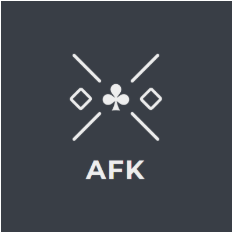

# AFKForum

AFKForum is a website-based forum made for gamers. Through threads they can share thoughts and experiences, as well as discussing whatever gaming related topic their heart desires. 

A link to the gitLab repository: [https://gitlab.stud.idi.ntnu.no/tdt4140-2020/20](https://gitlab.stud.idi.ntnu.no/tdt4140-2020/20)

## Tech/framework used
AFKForum is made in `Django 2.2` with `Python 3.7.6`. Notable thirdparty software used is:
 - [django-contrib-comments](https://django-contrib-comments.readthedocs.io/en/latest/index.html) - framework for comments
 - [django-updown](https://github.com/weluse/django-updown) - framework for voting
 - [SQLite](https://www.sqlite.org/index.html) - database engine
 - [bootstrap](https://getbootstrap.com/) - frontend component library
 - [django-crispy-forms](https://django-crispy-forms.readthedocs.io/en/latest/) - for controlling the rendering of forms elegantly


## Features
Make your own account to get access to special features such as
 - Make your own threads - anything gaming related goes!
 - Comment on other people's threads
 - Give threads a downvote or an upvote to show what you think!

## Installation
### Creating a virtual environment
It is recommended to make your own environment for this:
```bash
python -m venv env
```
where `env` can be substituted with whatever you want. 
### Set up
Start by cloning the git repo for the project:
```bash
git clone https://gitlab.stud.idi.ntnu.no/tdt4140-2020/20.git
```
Then enter the new folder made called `20` in a terminal and run this command to install all the prerequisites:
```bash
pip install -r requirements.txt
```
To create a local database (if not already made) run the command:
```bash
python manage.py migrate
```
Start the server by running the command:
```bash
python manage.py runserver
```
Then go to `localhost:8000` to find the website.

## Testing
We have so far relied only on usertesting and thus have no tests to run. More information on this subject can be found in our Wiki under the page [Code Quality and Testing](https://gitlab.stud.idi.ntnu.no/tdt4140-2020/20/-/wikis/Code-Quality-and-Testing#testing)

## Contributors
 - Anchana Visvalingam Balasingham
 - Andreas Brennsæter
 - Erle Nilsen Utler
 - Hanne Kyllo Ødegård
 - Harald Witsø
 - Hedda Ugland
 - Liv Elise Herstad

## License
The [MIT License](https://opensource.org/licenses/mit-license.php) is used to license the code in this project. 