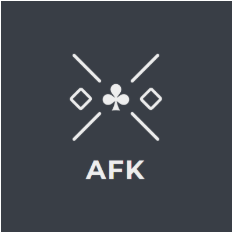
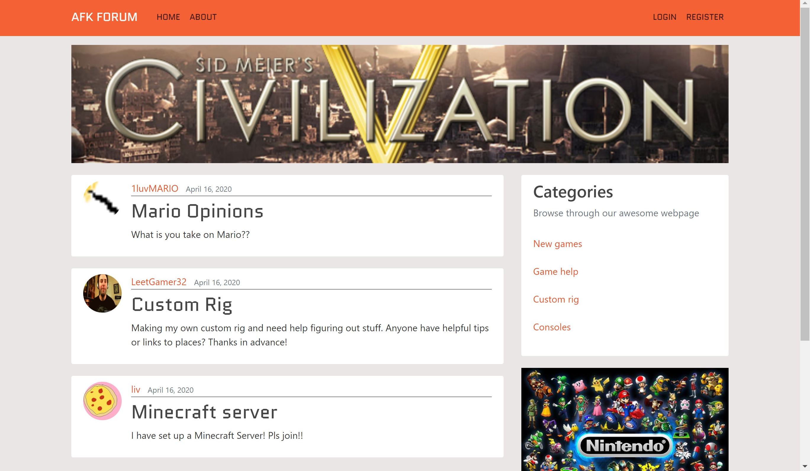

# AFKForum

AFKForum is a website-based forum made for gamers. Through threads they can share thoughts and experiences, as well as discussing whatever gaming related topic their heart desires. 

A link to the gitLab repository: [https://gitlab.stud.idi.ntnu.no/tdt4140-2020/20](https://gitlab.stud.idi.ntnu.no/tdt4140-2020/20)

## Motivation
The idea of creating this application was to facilitate a place where gamers could share their achievements, in addition to discuss and ask questions to relevant gaming topics.
We are well aware that there is a lot of gaming forums out there, but our goal is to improve the forum idea and make it even greater and with better and more suitable functionalites. 

## Code style

## Screenshot



## Tech/framework used
AFKForum is made in `Django 2.2` with `Python 3.7.6`. Notable thirdparty software used is:
 - [django-contrib-comments](https://django-contrib-comments.readthedocs.io/en/latest/index.html) - framework for comments
 - [django-updown](https://github.com/weluse/django-updown) - framework for voting
 - [SQLite](https://www.sqlite.org/index.html) - database engine
 - [bootstrap](https://getbootstrap.com/) - frontend component library
 - [django-crispy-forms](https://django-crispy-forms.readthedocs.io/en/latest/) - for controlling the rendering of forms elegantly
 

## Features
Make your own account to get access to special features such as
 - Make your own threads - anything gaming related goes!
 - Comment on other people's threads
 - Give threads a downvote or an upvote to show what you think!

## Installation
It is important that you install python, django and pip before you continue on.

### Cloning the project
Start by cloning the git repo for the project. This can be done in two ways:

 1. With https:
	 ```git clone https://gitlab.stud.idi.ntnu.no/tdt4140-2020/20.git```
2. With SSH:
  ```git clone git@gitlab.stud.idi.ntnu.no:tdt4140-2020/20.git```

Enter the root-directory of the project you just downloaded.

### Creating a virtual environment
It is recommended that you make your own environment for this project, but it is not a requirement. (If you don't want to do it, simply skip this next bit.)

To create the virtual environment run this command:
```
python -m venv env
```
This should make a folder named `env`. To activate the environment use this command:
```
.\env\Scripts\activate
```

### Set up
To install all the required libraries etc. run this command:
```
pip install -r requirements.txt
```
To create a local database (if not already made) run the command:
```
python manage.py migrate
```
This should make a file named `db.sqlite3` which is the newly created database.

Start the server by running the command:
```
python manage.py runserver
```
Then go to `localhost:8000` to find the website. It should look similar to the website you saw in the screenshot above.

## Testing
We have so far relied only on usertesting and thus have no tests to run. More information on this subject can be found in our Wiki under the page [Code Quality and Testing](https://gitlab.stud.idi.ntnu.no/tdt4140-2020/20/-/wikis/Code-Quality-and-Testing#testing)

## How to use?
For more information, see the Wiki-page called [User Manual](https://gitlab.stud.idi.ntnu.no/tdt4140-2020/20/-/wikis/User%20Manual ). 

## Contributors
 - Anchana Visvalingam Balasingham
 - Andreas Brennsæter
 - Erle Nilsen Utler
 - Hanne Kyllo Ødegård
 - Harald Witsø
 - Hedda Ugland
 - Liv Elise Herstad

## Contribute
If you want to contribute you can fork and make merge-requests.

## Credits
We are grateful to Corey Schafer and his YouTube-channel for helping us out with several challenges during the project. 

## License

The [MIT License](https://opensource.org/licenses/mit-license.php) is used to license the code in this project. 